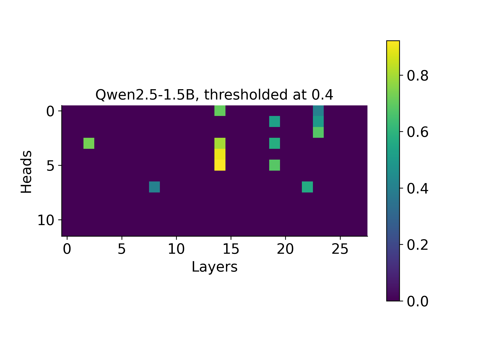

# A Circuit for predicting Hierarchical Structure in-context in Large Language Models

You can read the paper [here](https://www.arxiv.org/abs/2509.21534).


## Abstract

> Large Language Models (LLMs) excel at in-context learning, the ability to use information provided as context to improve prediction of future tokens. Induction heads have been argued to play a crucial role for in-context learning in Transformer Language Models. These attention heads make a token attend to *successors* of past occurrences of the same token in the input. This basic mechanism supports LLMs' ability to copy and predict repeating patterns. However, it is unclear if this same mechanism can support in-context learning of more complex repetitive patterns with hierarchical structure or contextual dependencies. Natural language is teeming with such cases. For instance, the article `the` in English usually prefaces multiple nouns in a text. When predicting which token succeeds a particular instance of `the`, we need to integrate further contextual cues from the text to predict the correct noun. If induction heads naively attend to all past instances of successor tokens of `the` in a context-independent manner, they cannot support this level of contextual information integration. In this study, we design a synthetic in-context learning task, where tokens are repeated with hierarchical dependencies. Here, attending uniformly to all successor tokens is not sufficient to accurately predict future tokens. Evaluating a range of LLMs on these token sequences and natural language analogues, we find adaptive induction heads that support prediction by learning what to attend to in-context. Next, we investigate how induction heads themselves learn in-context. We find evidence that learning is supported by attention heads that uncover a set of latent contexts, determining the different token transition relationships. Overall, we not only show that LLMs have induction heads that learn, but offer a complete mechanistic account of how LLMs learn to predict higher-order repetitive patterns in-context.

## Repository info

This is the repository for the project **A circuit for predicting hierarchical structure in-context in Large Language Models**.


Our code can be used to reproduce results for various LLMs on huggingface, including models in the Qwen2.5 and Qwen3 family, Llama 3.1, SmolLM2 and Gemma 2. For other LLMs with different architectures, our code may need slight adaptations to run.


## Getting started

Make sure you have the dependencies installed as follows:

```bash
python3 -m venv .venv
source .venv/bin/activate
pip install -r requirements.txt
```

All the results were generated using Python 3.12.5 . 

Suppose you want to analyze the induction head circuits of Qwen2.5-1.5B. First we need to know which of the model's heads are induction heads. We classify heads by running the following script:

```bash
python src/score_induction.py --model_name=Qwen/Qwen2.5-1.5B --threshold=0.4
```

We say that any head that has a matching score $\ge 0.4$ is an induction head. Let's inspect what comes out of this classification by running <code>python plotting/visualize_induction_scores.py --model=Qwen/Qwen2.5-1.5B</code>




## In-context learning experiment
Next, we want to know how the model fares in our proposed task. We have two hierarchy settings, which we control with the parameter <code>markov_order</code> (e.g. at which level in the hierarchy are transitions between chunks Markovian). Furthermore, the scripts have a default data generation setting which we used to generate the main results in the paper.


```python
def get_config():
    parser = ArgumentParser()

    parser.add_argument('--n_reps', default=8, type=int)
    parser.add_argument('--batch_size', default=4, type=int) # number of samples to be processed in parallel. Can be changed, but total_batch_size must be divisible by batch_size
    parser.add_argument('--total_batch_size', default=32, type=int) # total number of samples in experiment
    parser.add_argument('--n_permute', default=4, type=int) # number of 2nd order chunks
    parser.add_argument('--chunk_size', default=8, type=int) # size of 2nd order chunks
    parser.add_argument('--markov_order', default=2, type=int) # controls the hierarchy level
    parser.add_argument('--n_permute_primitive', default=4, type=int) # if markov_order==3, then this controls the number of 2nd order chunks
    parser.add_argument('--model_name', default='Qwen/Qwen2.5-1.5B', type=str)   
    args, _ = parser.parse_known_args()
    args.iters = args.total_batch_size//args.batch_size
    if args.markov_order==3:
        args.chunk_size = args.chunk_size//2 # if markov_order==3 we halve the chunk size to avoid sequences blowing up

    return args
```

If markov_order = 2, a chunk is a randomly permuted sequence drawn from the vocabulary.
If markov_order = 3, a chunk is a randomly permuted sequence of chunks, each of which is a randomly permuted sequence of tokens.

With this in mind, we can obtain the model performance and induction head learning scores by running the following script:

```bash
python src/find_learning_heads.py --model_name=Qwen/Qwen2.5-1.5B --markov_order=2
python src/find_learning_heads.py --model_name=Qwen/Qwen2.5-1.5B --markov_order=3
```

Let's plot how the model performed. We can do this by calling
<code>python plotting/plot_learning_individual.py --model_name=Qwen/Qwen2.5-1.5B</code>:

<p align="center">

</p>

We see that not only does the LLM learn to solve the task, but the top 5 learning induction heads also show a strong learning signal. Moreover, we also plot heads that attend to the right context without attending to the successor tokens necessarily, potentially supporting learning in different ways.

### Natural language task

In natural language, there are many situations where simply learning bigram statistics is not sufficient to predict what comes next. We see below that learning induction heads can integrate contextual cues to make good predictions. This is not possible for 'static' induction heads that do not integrate such cues.

```bash
python plotting/plot_natural_language.py
```

<p align="center">

</p>

## Decoding the latent context

To find the heads we hypothesize are responsible for making induction heads learn (we call them *context matching heads*), we conduct decoding analyses. For our two experimental settings (<code>markov_order=m</code>), we can run the following script to obtain. Specifically, for a set of tokens in an $m$-order chunk $C=<x_1, ..., x_n>$., we train linear probes to decode whether the previous $m$-order chunk is identical to the $m$-order chunk composed of the tokens $C$. We get decodability scores for all heads by running the following script

```bash
python src/trace_nback2.py --model_name=Qwen/Qwen2.5-1.5B --markov_order=2 --module=heads
python src/trace_nback2.py --model_name=Qwen/Qwen2.5-1.5B --markov_order=3 --module=heads
```
This script accepts a <code>module</code> argument. We can use this to decode from the residual stream and other parts of the model too.


We can plot the max decodability per layer by calling

```bash
python plotting/plot_context_decodability_individual.py --model_name=Qwen/Qwen2.5-1.5B
```

<p align="center">

</p>


## Ablation experiments: Establishing a causal connection

### Attention

Finally, let's see if the induction heads and context matching heads are causally linked to the LLM's ability to learn in-context in our task. To do this we make use of the amazing <code>nnsight</code> library, where we can easily ablate, or lesion, parts of the attention computations that the LLM do in a forward pass. Recall that for a head $h_n$, and a sequence of tokens $X = <x_1, ..., x_n>$, scaled dot product attention computes attention scores between tokens $x_i$ and $x_j$, $a_{i,j}$, as follows: First, each token is mapped to keys $k$, queries $q$ and values $v$. A token $x_i$ attends to another token $x_j$ proportional to the exponential of the dot product between their query and key vector.

$$a_{i, i} \propto exp{\left(\dfrac{q_i  k_j}{\sqrt{d}} \right)}$$


Now let's define the output of the attention operation of this head for token $x_i$, namely $z_i$, as the sum of all tokens' value vector $v_j$ scaled by how much $x_i$ attends to token $x_j$ in head $h$:


$$z_{i} = \sum_j^{n}a_{i, j} v_j$$


In our ablation analysis, this $z$ variable is the one we target. <code>nnsight</code> allows us to do pretty much what we want with this variable before it is passed to the <code>o_proj</code> linear layer that mixes the attention heads' outputs back into the residual stream. To ablate an attention head, we simply set the corresponding attention represention $z$ to a vector of zeros, $z=\boldsymbol{0}$. 


### How do context matching heads inform induction heads?
Let's look more closely at a context matching head and an induction head that work in tandem in the model. We will ablate context matching head $13$-$4$, and observe how it affects a subsequent induction head $14$-$3$. We can do this by running the following experiment:

<code>python src/inspect_ablated_inductionv2.py --total_batch_size=84 --model_name=Qwen/Qwen2.5-1.5B</code>

We see that the induction head largely attends to successor tokens still, but strikingly, loses its ability to attend to successor tokens from **the right contexts**


### Full scale ablations

When ablating the heads of a model we gotta make sure we have a good control condition to measure the effect of the ablation. In our paper, we compare ablations of particular heads (induction heads or context matching heads), with ablations of the **same number** of randomly selected heads that do not classify as the target head in question.

We can run these ablation experiments for <code>markov_order=2</code> with the following script:

```bash
python src/ablate_heads.py --model_name=Qwen/Qwen2.5-1.5B --markov_order=2 --ablation_style=induction --threshold=0.4
python src/ablate_heads.py --model_name=Qwen/Qwen2.5-1.5B --markov_order=2 --ablation_style=random_induction --threshold=0.4
```

Note that we change what heads to ablate with the <code>ablation_style</code> parameter. Here we ablate induction heads and randomly selected counterparts, where we classify heads as induction heads using the threshold $\ge0.4$

We can do the same with the context matching heads like this:

```bash
python src/ablate_heads.py --model_name Qwen/Qwen2.5-1.5B --markov_order=2 --batch_size=2 --ablation_style=one_back --threshold=0.85
python src/ablate_heads.py --model_name Qwen/Qwen2.5-1.5B --markov_order=2 --batch_size=2 --ablation_style=random --threshold=0.85
```

Here we classify a head as a context matching head if it has a latent context decodability $\ge0.85$. We can see that the effect of ablating the context matching heads are severe compared to ablating random heads in Qwen2.5-1.5B


## Citation

```bibtex
@misc{saanum2025circuitpredictinghierarchicalstructure,
      title={A circuit for predicting hierarchical structure in-context in Large Language Models}, 
      author={Tankred Saanum and Can Demircan and Samuel J. Gershman and Eric Schulz},
      year={2025},
      eprint={2509.21534},
      archivePrefix={arXiv},
      primaryClass={cs.LG},
      url={https://arxiv.org/abs/2509.21534}, 
}
```